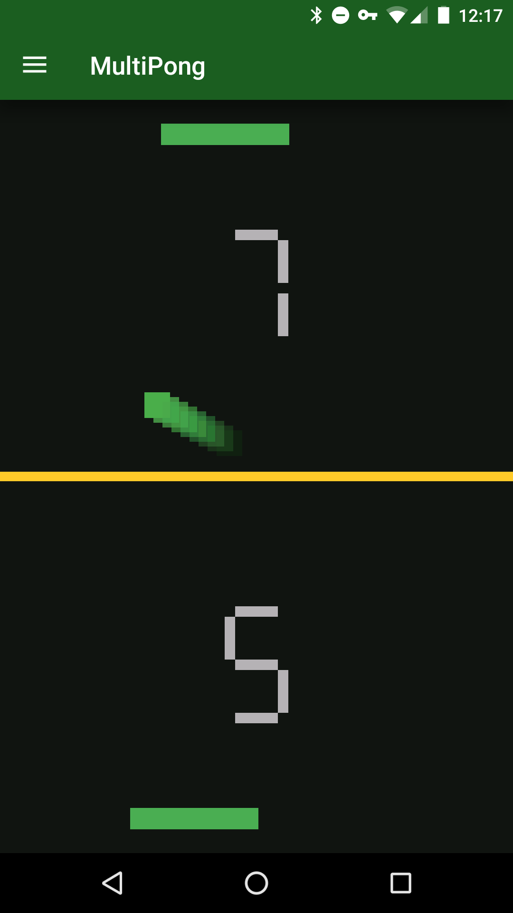

# Pong
A pong clone for Android.

Get it on [Google Play](https://play.google.com/store/apps/details?id=com.brandon.pong) now! 

### Single player
Two paddles per screen. Each half of the screen controls on of the paddles. Ball bounce angle changes depending on the whether the paddles are moving and the direction of their movement.

Once the 10 points are reached, points are reset.

### Double player
One paddle per screen. Host or connect to a game through bluetooth. Opponent device must be paired with current device. Player that hosts game starts with ball.

Ball speed in X and Y direction and ball's position is determined as a percentage of the screen's width and height when the data is sent over to opponent. Ball disappears when it hits the top edge of screen and is shown on opponent's device.

